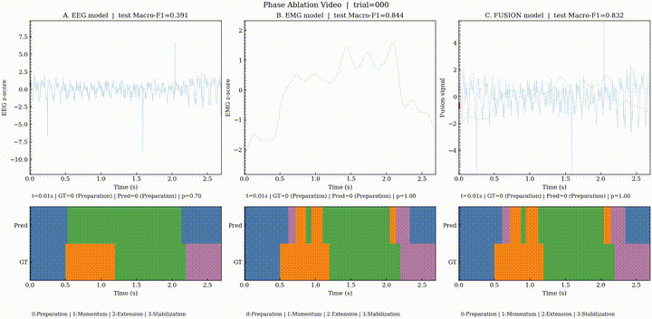
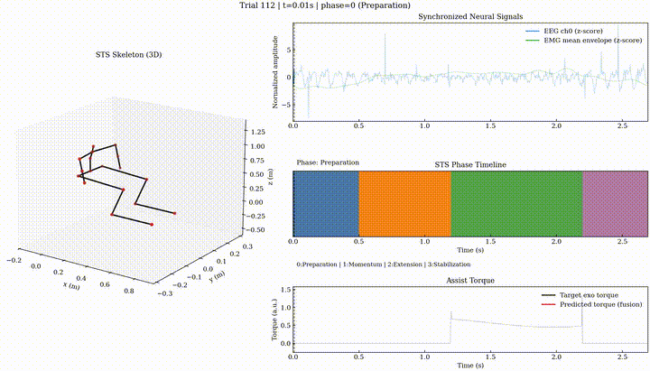
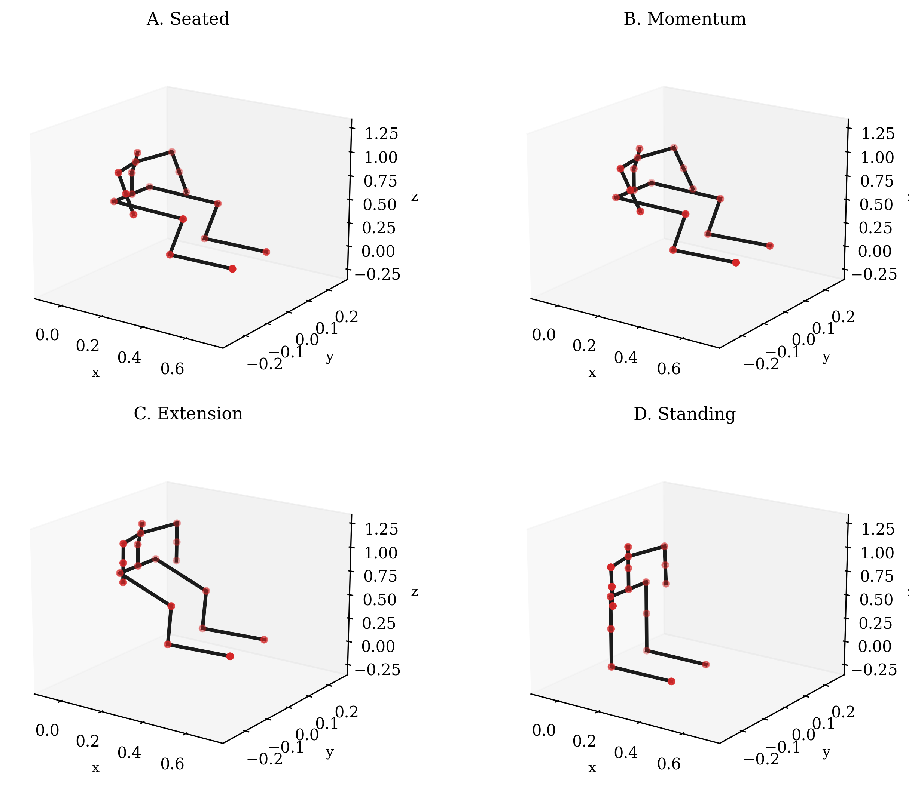
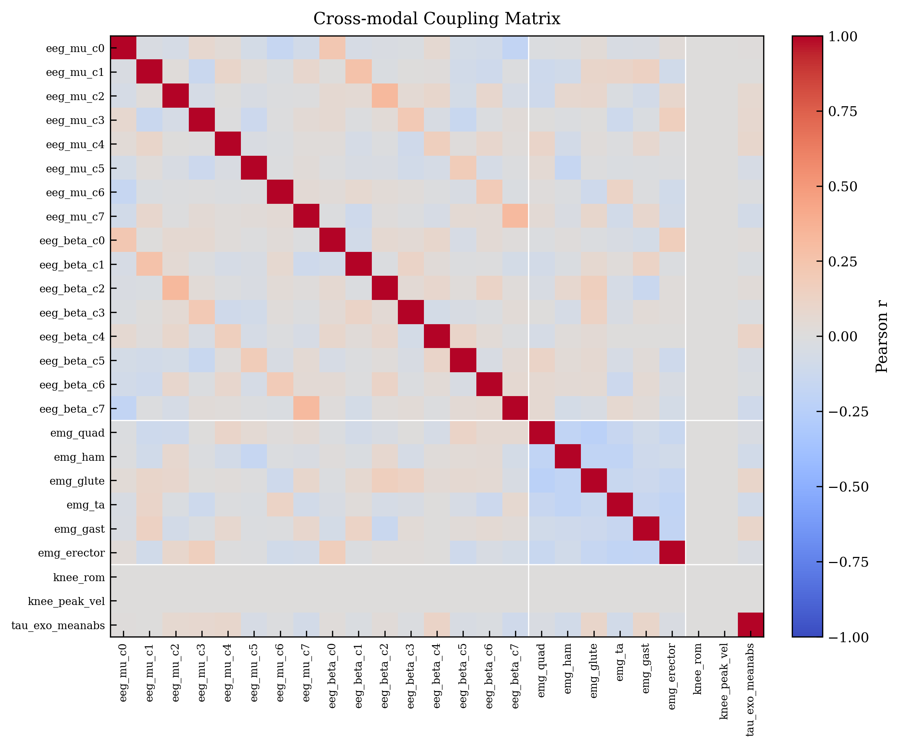
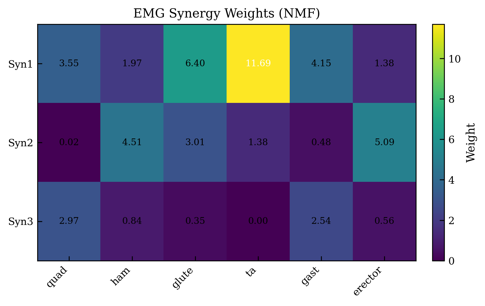

# STS Digital Twin Pipeline

> A multimodal sit-to-stand virtual lab for phase decoding, EMG synergy analysis, and assistive torque benchmarking.


<p align="center">
  
</p>

This project turns a sit-to-stand motion into a full offline benchmark: synchronized kinematics, EEG, EMG, phase labels, assistive torque targets, interpretable synergies, model ablations, and visual reports in one reproducible pipeline.

## At A Glance

- portfolio-ready multimodal demo with animated previews
- end-to-end benchmark from generated trials to validation report
- clean artifact story: figures, GIFs, MP4s, JSON metrics, Markdown summary
- stronger evaluation framing with subject-wise split by default

## Highlights

- multimodal STS pipeline from raw trial generation to benchmark report
- EEG-only, EMG-only, and fusion phase decoding
- torque prediction for exoskeleton assistance studies
- subject-wise evaluation by default
- paper-style figures, videos, and validation reports per run

## Demo Gallery

<p align="center">
  
  
</p>

<p align="center">
  
  
</p>

## What It Shows

- 3D stick-skeleton kinematics across the full sit-to-stand cycle
- EEG and EMG signals aligned with movement phase
- learned EMG synergy structure
- fusion vs single-modality phase decoding
- assistive torque prediction under a controlled benchmark protocol

## Benchmark Snapshot

Reference report: [`docs/validation_subject.md`](docs/validation_subject.md)

| Task | Model | Result |
| --- | --- | ---: |
| Phase decoding | EEG | Macro-F1 `0.375`, Acc `0.633` |
| Phase decoding | EMG | Macro-F1 `0.785`, Acc `0.806` |
| Phase decoding | Fusion | Macro-F1 `0.784`, Acc `0.803` |
| Torque prediction | Fusion | RMSE `0.840`, approx. R2 `0.314`, corr `0.587` |
| Synergy decomposition | NMF | VAF `0.645` with `K=3` synergies |

Protocol:
- 30 subjects
- 240 trials
- 2160 segments
- subject-wise split with zero subject overlap across train, val, and test

## Visual Outputs

<p align="center">
  
  
</p>

The full local run also exports:
- coupling heatmaps
- EEG time-frequency plots
- synergy activation heatmaps
- modality ablation figures
- torque prediction overlays
- robustness curves
- MP4 demo videos

## Why It Feels Like A Real Project

- config-driven pipeline with a single `run_all.py` entrypoint
- benchmark artifacts saved per run
- validation report in Markdown and JSON
- fairer default evaluation with `split_strategy: subject`
- clear separation between demo assets and heavyweight local outputs

The data source is still in-silico. The point of the repository is to function as a serious offline R&D bench for multimodal controller development, not to pretend these are clinical trial results.

## Tech Stack

- Python for orchestration and experiment scripting
- NumPy and SciPy for signal generation and feature processing
- PyTorch for phase decoding and torque regression models
- Matplotlib for paper-style visual outputs
- ffmpeg for demo video and GIF export
- YAML configs for reproducible run settings

## Quickstart

```bash
python -m venv .venv
source .venv/bin/activate
pip install -r requirements.txt
python run_all.py --config configs/default.yaml
```

Generated outputs land in `outputs/<run_id>/`:
- `data_raw/`
- `artifacts/`
- `figures/`
- `videos/`
- `reports/`

## Pipeline

1. Generate synchronized STS trials with kinematics, EEG, EMG, phase labels, and torque targets.
2. Fit EMG synergies with NMF.
3. Train phase decoders for `eeg`, `emg`, and `fusion`.
4. Train the fusion torque regressor.
5. Render figures, videos, and a validation report.

## Run Manually

```bash
python scripts/01_generate_data.py --config configs/default.yaml
python scripts/02_fit_synergy.py --run_dir outputs/<run_id>
python scripts/03_train_phase.py --run_dir outputs/<run_id> --modality fusion
python scripts/03_train_phase.py --run_dir outputs/<run_id> --modality eeg
python scripts/03_train_phase.py --run_dir outputs/<run_id> --modality emg
python scripts/04_train_torque.py --run_dir outputs/<run_id>
python scripts/05_make_figures.py --run_dir outputs/<run_id>
python scripts/06_render_skeleton.py --run_dir outputs/<run_id>
python scripts/07_make_video.py --run_dir outputs/<run_id> --trial_index 0
python scripts/08_make_video_ablation.py --run_dir outputs/<run_id> --trial_index 0
python scripts/09_make_validation_report.py --run_dir outputs/<run_id>
```

To recompute a benchmark for an existing run with subject-wise evaluation:

```bash
python scripts/09_make_validation_report.py \
  --run_dir outputs/<run_id> \
  --split_strategy subject \
  --recompute
```

## Repo Assets

- benchmark report: [`docs/validation_subject.md`](docs/validation_subject.md)
- showcase figures and GIFs: [`assets/showcase`](assets/showcase)

## Intended Use

Use this repo for:
- portfolio showcase
- offline algorithm prototyping
- multimodal ablation studies
- internal demo and visualization workflows
- pre-real-data benchmark development

Do not use it to claim validated performance on real human recordings without an external calibration and evaluation stage.
